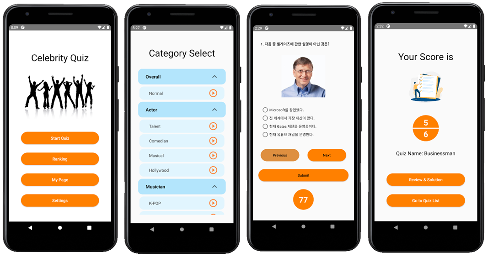

# Celebrity Quiz

This is a game app that users can see photo of celebrities and score points by solving quizzes.

The quizzes are 4-choice or short answer type, and they are downloaded from the server and displayed, so the developer can edit or add quizzes without updating the app.
Quizzes are classified by category, and users can select and solve the quiz they want.
If they choose and solve the quiz, the score screen appears, and they can check the solution if they want. 
The score can be viewed on the My Page screen and registered in the global ranking. Ranking and login were implemented with Google Firebase.
The category list, quiz list, and ranking were implemented with Android RecyclerView. 

## Screenshots

## License
MIT License

Some images were taken from [Freepik] and [Iconscout].

[Freepik]: https://kr.freepik.com/free-vector/people-dancing-silhouette_837170.htm
[Iconscout]: https://iconscout.com/illustration/concept-of-to-do-list-2112526
